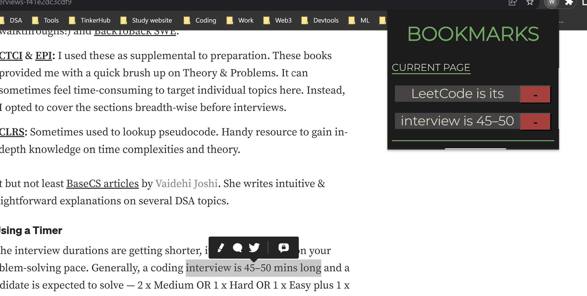

# WEBCLIPPER

This is a bookmarker that can be used to mark a specific part in a webisite and later can be used to refer to that selected texts when visited.

## Contribute 
To contribute check this section!
<details>
  <summary>Contents</summary>
  <ol>
    <li>
      <a href="#features">About The Project</a>
      <ul>
        <li><a href="#current-version">Now</a></li>
        <li><a href="#what-next">Next</a></li>
        <li><a href="#setup">Setting Up</a></li>
      </ul>
    </li>
    <li>
      <a href="#Contributing">Contributing</a>
      <ul>
        <li><a href="#technology-stack">Stacks used</a></li>
        <li><a href="#contributing">How to contribute?</a></li>
      </ul>
    </li>
    <li>
      <a href="#team">About us : )</a>
    </li>
  </ol>
</details>

## Features

- Shows the list of all the selected text in the present webpage

<u> 

##
</u>

### Current version 
- We have created a clean and minimalistic UI. <p> 
-  The selected texts of each webpage os stored using `local storage`
- Teh first three words of selected text can be viewed 


### What next?
- The whole selected texted is viewed by toggle 
- Show the list of websites from which we have marked the selected text
- Scroll to the specific pages section of the page which we have have bookmarked

<!-- 
## Demo Video
<a href="https://www.loom.com/share/4b5ac808cb824ead874c931b9e0b6660" target="_blank" rel="noopener">
  
</a>

<!--  -->
## Technology Stack: 


   
<!--  

- **Stacks**: HTML, CSS, JS
- **IDE**: VS Code
- **Version Control**: Git and GitHub --> 


### Setup
---
- Fork and Clone the repo using

```
$ git clone https://github.com/riya461/WebClipper

```
- Switch to developer mode in Google chrome extensions
- Load the folder extension in Google Chrome Extensions 


- Select the text and choose 'WebClip this' to add the text 
- check the extension from the extension tab and you can view the selected textx from the current page 


## Browser Support

- **Chrome**: any version

## Contributing
Any contributions, small or big, appreciated.

Check out the issues and let us know if you can help us with any of them.

If you have any idea for making this better, simply open a new issue.

1. Fork the Project
2. Create your Branch (`git checkout -b branchname`)
3. Add the features to code . Stage changes (`git add .`)
4. Commit your Changes (`git commit -m 'Mention feature or change brought to this'`)
5. Push to the Branch (`git push origin branchname`)
6. Open a Pull Request

## Team

<!-- This is a project made by  -->

| S.No. | Name               | Role               | GitHub Username                            |
| ----- | ------------------ | ------------------ | ---------------------------------------------------- |
| 1.    | Riya Sabu      | Backend Developer | [@riya461](https://github.com/riya461) |
| 2.    | Devika B | Backend Developer  | [@dev221b](https://github.com/dev221b)           |
| 3.    | Srutav Tarun          | FrontEnd developer                 | [@SrutavTarun](https://github.com/SrutavTarun)         |
| 4.    | Adithya D          | FrontEnd developer                 | [@ad-nat-delt](https://github.com/ad-nat-delt)         |

